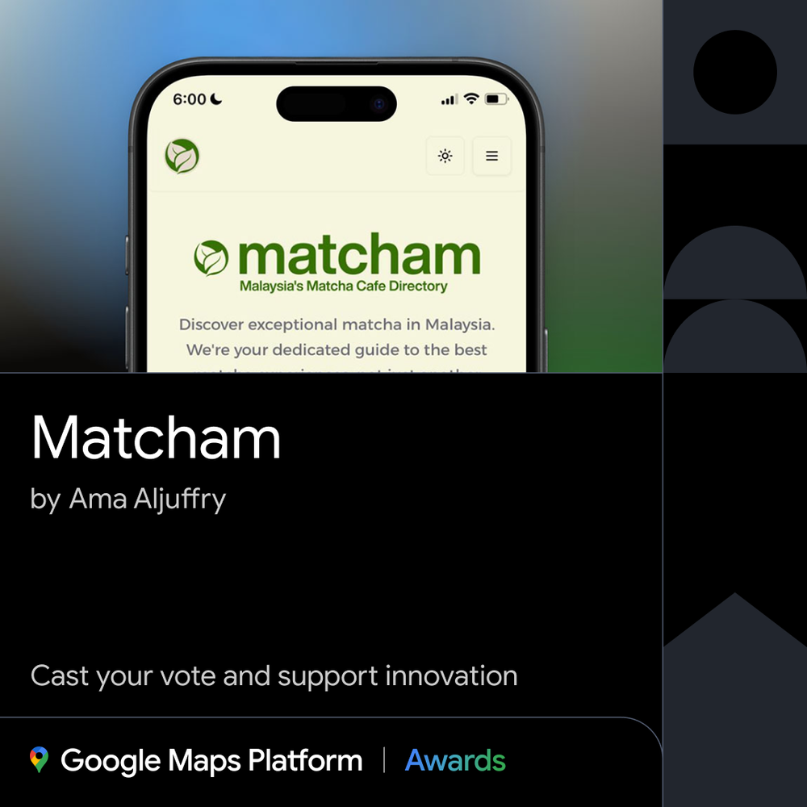

# 🧭 Matcham.my

**Live Site:**  
👉 [https://www.matcham.my](https://www.matcham.my)

---

## 🌿 Project Inspiration

Matcham.my was born from Malaysia’s rising matcha culture and the lack of a comprehensive, well-designed directory for matcha cafes nationwide.

As passionate matcha enthusiasts, we noticed existing platforms were often outdated, poorly organized, or lacked meaningful discovery features. Our goal was to build more than a list — we wanted a community-focused map that helps users explore, plan their matcha adventures, and share their own discoveries.

---

## 🔧 Project Background

- **Ideation:** Sparked by the frustration of finding scattered, unreliable information on matcha cafes and a desire to spotlight local gems.
- **Development:** Built using **Next.js**, **Supabase**, and the **Leaflet + OpenStreetMap**. The project went through several iterations to refine UX, filtering, and map behavior.
- **Community Focus:** We actively encourage user submissions and feedback to keep the directory current, curated, and collaborative.

---

## 🗺️ OpenStreetMap Platform Integration

- **Maps JavaScript API:**  
  The interactive map is central to the platform. Each cafe is marked and clickable for details with Leaflet + OpenStreetMap
  
- **Geolocation:**  
  Automatically centers the map to the user’s location for easy discovery nearby.

- **Custom Markers & Styling:**  
  Matcha-themed design and icons to reflect the brand identity.

- **Responsive Map Dialog:**  
  Full-screen and modal views for desktop and mobile.

---

## 🚀 Key Differentiators

- **✅ Curated Content**  
  Verified cafes with detailed profiles, not just crowdsourced listings.

- **✅ Modern & Accessible UI**  
  Mobile-first design, responsive components, and clean navigation.

- **✅ Community Submissions**  
  Anyone can suggest a new cafe; all submissions are reviewed for accuracy.

- **✅ Performance Optimized**  
  Server-side filtering, efficient pagination, and fast rendering.

- **💡 Learnings**  
  - Integrating Google Maps with custom UI was powerful but required careful handling for responsiveness and key security.
  - User feedback improved the overall experience significantly.
  - Handling incomplete data helped strengthen UI resilience.

---

## 📸 Feature Walkthrough

1. **Homepage**
   - Welcome banner, search by state, curated cafe list.
2. **Interactive Map**
   - Clickable pins, visual exploration of cafes.
3. **Cafe Detail Page**
   - Location, operating hours, map view, and info.
4. **Submit a Cafe**
   - Simple community form for new cafe submissions.
5. **Responsive Design**
   - Works across desktop and mobile with consistent UX.

---

## 🙏 Thank You

Thank you for considering **Matcham.my** for the **Google Maps Platform Awards**.

If you'd like a more detailed walkthrough, UI screenshots, or a demo video — feel free to reach out!

---

